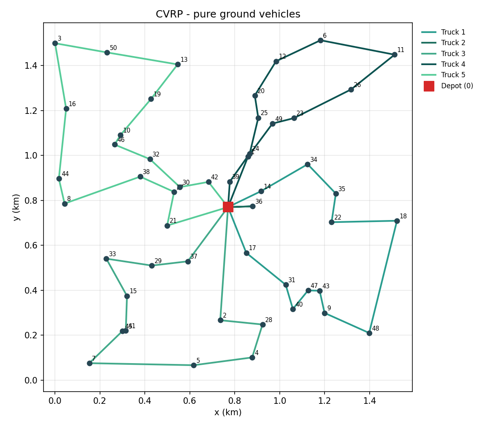
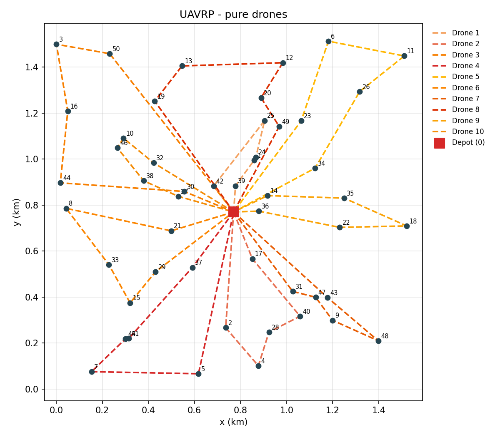
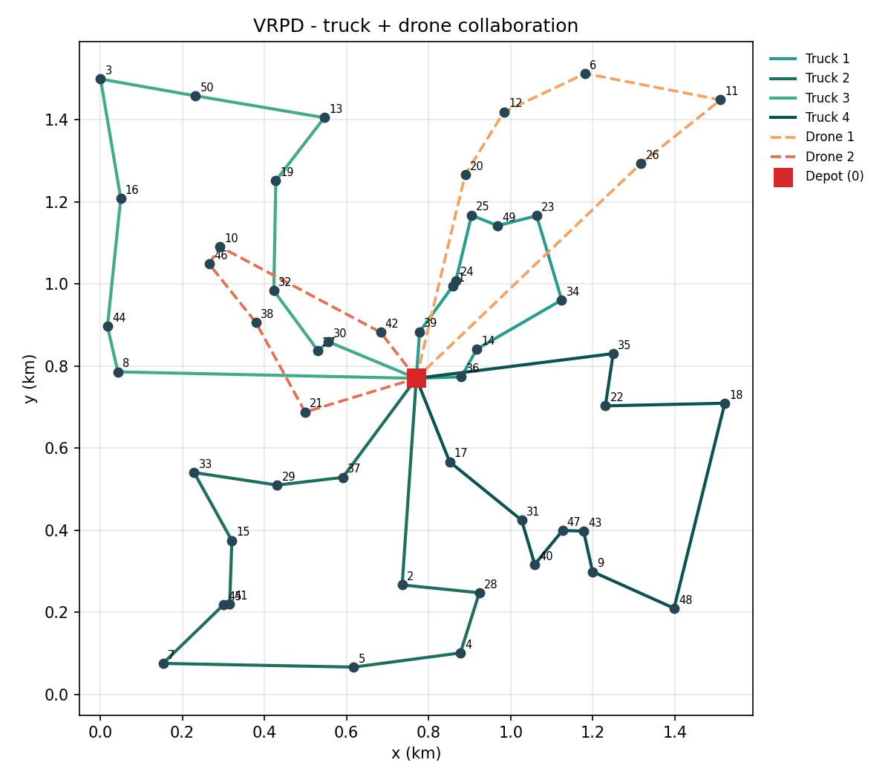

# low-altitude-vrpd

Code for

> Gong, J. (2025). *Research on Optimization of Urban Logistics Network Based on Low Altitude
> Economy: Path Planning and Traffic Impact Analysis of Collaborative Distribution Mode Between
> Drones and Ground Vehicles.* ([PDF](paper/Gong_2025_Low_Altitude_Urban_Logistics_VRPD.pdf))

One depot, 50 customers with fixed demand, three ways of serving them, one question: which is
the most efficient?

| Group | Problem | Fleet | Distance metric |
|---|---|---|---|
| **CVRP** | pure ground vehicles | 5 trucks | Manhattan (road network) |
| **UAVRP** | pure drones | 10 drones | Euclidean (straight-line flight) |
| **VRPD** | trucks + drones in parallel | 4 trucks + 2 drones | Manhattan / Euclidean |

Efficiency is the weighted indicator of Eq. (1), *Z = 0.8 · (time value) · T + 0.2 · C*,
where *T* is the total delivery time (Eq. 2–4) and *C* the total transport cost (Eq. 5–6);
**lower Z is better**.  All three groups share the same customers, the same demand, the same
capacities and the same fixed cost (250 · 10k CNY), so the numbers are directly comparable.

<!-- RESULTS:BEGIN -->
## Results – Shenzhen case study (Section 5)

Output of `python run_all.py` on the 50-customer instance (seed 2025) with Gurobi 12.0:

| Group | Fleet | Distance (km) | Total cost (10k CNY) | Total time (min) | **Efficiency Z** | Solver |
|---|---|---:|---:|---:|---:|---|
| UAVRP | 10 drones | 17.65 | 267.65 | 57.65 | 58.14 | time limit 900 s, gap 2.78 % |
| CVRP | 5 trucks | 13.84 | 261.07 | 66.52 | 57.54 | optimal (gap 0.93 %), 1.5 s |
| **VRPD** | 4 trucks + 2 drones | 14.72 | 262.50 | **53.37** | **56.77** | time limit 1800 s, gap 4.91 % |

**The collaborative fleet is the most efficient option**: its Z is 1.3 % below the pure-truck
fleet and 2.4 % below the pure-drone fleet.  It completes the round 20 % faster than the trucks
alone and 7 % faster than the drones alone, for a total cost only 0.5 % above the cheapest
(pure-truck) plan.  The two drones take the two outlying clusters that are expensive to reach
by road, the four trucks cover the dense core – the division of labour the paper argues for.

Two-stage solution of the collaborative group: the genetic algorithm reached Z = 56.95 after
83 generations (27 s); the warm-started MILP improved it to 56.77 within its time limit.

| CVRP – 5 trucks | UAVRP – 10 drones | VRPD – 4 trucks + 2 drones |
|---|---|---|
|  |  |  |

All routes (the regenerated Table 1) are in [`results/summary.md`](results/summary.md);
machine-readable copies in [`results/summary.csv`](results/summary.csv) and
[`results/routes.json`](results/routes.json).  Every plan above passed `vrpd.verify`:
payload ≤ 60 kg per truck, ≤ 20 kg and ≤ 5 km per drone sortie, each customer served once.
<!-- RESULTS:END -->

## Repository layout

```
vrpd/
  config.py        every parameter of Section 5.1 in one frozen dataclass (Params)
  instance.py      depot + customers + Manhattan / Euclidean distance matrices
  metrics.py       Eq. (1)–(6): time, cost and efficiency of a plan
  verify.py        independent feasibility check against Eq. (7)–(16)
  heuristics.py    nearest neighbour (§4.4), 2-opt, sweep partition, drone-sortie repair
  ga.py            genetic algorithm + warm start (§4.5, §4.6)
  plotting.py      route figures (Fig. 8 style)
  models/
    cvrp.py        pure-truck MILP
    uavrp.py       pure-drone MILP
    vrpd_model.py  collaborative MILP, the complete model of §3.4
run_all.py         reproduces the Shenzhen case study end to end
tests/             pytest suite, including checks against the paper's published tables
results/           tables, route JSON and figures of the last full run
paper/             the paper
```

## Installation

```bash
pip install -r requirements.txt
```

The MILPs are solved with [Gurobi](https://www.gurobi.com/).  A free
[academic licence](https://www.gurobi.com/academia/academic-program-and-licenses/) is enough;
the size-limited licence that ships with `pip install gurobipy` is **not** (the collaborative
model has ~15,000 binary variables).  Put the licence where Gurobi expects it (`gurobi.lic` in
your home directory, or point `GRB_LICENSE_FILE` at it); licence files are git-ignored.

Tested with Python 3.13, gurobipy 12.0, matplotlib 3.10.

## Usage

```bash
python run_all.py --quick     # 12-customer smoke run, ~15 s, checks that everything works
python run_all.py             # the 50-customer case study of Section 5 (up to ~1 h)
python -m pytest              # unit tests; the Gurobi tests skip themselves without a licence
```

`run_all.py` writes `summary.md`, `summary.csv`, `routes.json`, `instance.json` and one figure
per group into `results/` (`results/quick/` for `--quick`).  Every plan is passed through
`vrpd.verify` before it is reported, so a route that violates a payload or range limit cannot
end up in a table.

## The model (Section 3.4) and where it lives in the code

| Paper | Meaning | Code |
|---|---|---|
| Eq. (1) | min *Z* = 0.8 · 0.1 · *T* + 0.2 · *C* | `metrics.evaluate`, objective of each model |
| Eq. (2) | *T* = max{*T*<sub>truck</sub>, *T*<sub>drone</sub>} | makespan variable `T` in `vrpd_model.py` |
| Eq. (3)–(4) | mode times: 60/speed · distance + fixed time | `metrics.evaluate` |
| Eq. (5)–(6) | mode costs: unit cost · distance + fleet · fixed cost | `metrics.evaluate` |
| Eq. (7) | every customer served exactly once | `visit` constraints |
| Eq. (8)–(11) | every vehicle leaves and returns once, flow balance | `depart` / `return` / `flow` |
| Eq. (12)–(15) | MTZ sub-tour elimination + capacities | `mtz` / `load_lb` (load form, see below) |
| Eq. (16) | per-drone flight range | `range` |
| Eq. (17) | variable domains | variable declarations |

Two formulation details differ from the literal text while keeping the feasible set identical:

* **MTZ in load form.**  Eq. (12)/(13) use an abstract visiting order *u*; the code uses the
  vehicle load as the MTZ potential, which folds the capacity constraints Eq. (14)/(15) into
  the same inequality and gives a tighter LP relaxation.
* **Aggregated truck index in CVRP.**  Trucks are identical, so the pure-truck model uses
  `x[i, j]` with `num_trucks` depot departures instead of `x[k, i, j]`.  The collaborative
  model keeps the full `x[k, i, j]`, `y[d, i, j]` of the paper, plus a symmetry-breaking rule
  between identical vehicles.

## The method (Section 4)

```
CVRP  : nearest-neighbour warm start ─▶ Gurobi MILP
UAVRP : nearest-neighbour warm start ─▶ Gurobi MILP
VRPD  : baselines ─▶ warm-start seeds ─▶ genetic algorithm ─▶ Gurobi MILP (warm-started)
```

The genetic algorithm (`vrpd/ga.py`) works on the truck-vs-drone assignment of each customer;
a chromosome is decoded into routes by sweep partition + nearest neighbour + 2-opt, drone
sorties are repaired until payload and range hold, and the fitness is exactly Eq. (1).  Its
best plan is handed to the full MILP as a starting solution, so the final answer is never
worse than the GA plan and comes with a proven optimality gap.

## Tests

`tests/paper_tables.py` contains the routes printed in Table 1 of the paper.  The test-suite
shows that

* the published collaborative plan evaluates to the published Table 2 numbers
  (16.80 km, 14.68, 36.78 min, *Z* = 55.88) – i.e. this package scores plans exactly the way the
  paper does;
* the instance, distance matrices, heuristics and GA decoding behave as documented;
* on a 12-customer instance all three MILPs solve, their objective equals `metrics.evaluate`,
  and the collaborative MILP never returns a worse plan than its GA warm start.

<!-- NOTES:BEGIN -->
## Reproduction notes

This repository is a clean re-implementation of the three separate scripts that produced the
paper's case study.  The model (Section 3.4) and the solution method (Section 4) are the ones
described in the paper; what changed is the engineering around them, so that the three groups
are genuinely comparable and every reported plan is feasible:

1. **One instance, one parameter set.**  The original pure-truck and pure-drone scripts drew
   random demands of 1–4 kg (115 kg in total) while the collaborative script used the fixed
   4 kg of Assumption 9 (200 kg in total); vehicle capacities (40/10 kg vs 60/20 kg) and the
   objective weights (0.9/0.1 vs 0.8/0.2) also differed between scripts.  Every group now reads
   every parameter from `vrpd/config.py`, with the values of Section 5.1.
2. **Feasible baselines.**  The original pure-drone script re-ordered the solver's routes with
   a nearest-neighbour pass *after* optimisation, which silently broke the range constraint:
   the pure-drone sorties printed in the paper exceed both the 5 km range and the 20 kg
   payload (`tests/test_verify.py` demonstrates this).  Routes are now read directly off the
   solver variables and checked by `vrpd.verify` before they are reported.
3. **The solver optimises the reported indicator.**  The original collaborative MILP minimised
   the *sum* of truck and drone travel times without the time-value factor, then reported a
   differently defined Z.  The models now minimise Eq. (1) exactly, with
   T = max{T<sub>truck</sub>, T<sub>drone</sub>} as a makespan variable.
4. **The two-stage method is actually executed.**  The GA / warm-start module of the original
   code was never imported (and did not import cleanly).  The collaborative group now runs
   baselines → warm-start seeds → genetic algorithm → warm-started MILP, as in Section 4.1.
5. **Fixed service time per dispatched vehicle.**  Assumption 6 states that *each delivery
   tool* consumes a fixed loading / hand-over time, so `T_truck` and `T_drone` charge it once
   per vehicle dispatched (5 min per truck, 4 min per drone): a fleet of ten drones performs
   ten loading and hand-over operations, five trucks five, four trucks and two drones six.  The
   paper's Table 2 adds the term once per mode instead; because the fleet size of every group
   is fixed, both readings lead to identical routes and differ only in the reported time and
   Z.  The per-mode figures for the same routes are listed in the supplement of
   `results/summary.md` / `results/summary.csv`, and `Params.fixed_time_per` switches
   between the two.

Because of 1–3 the absolute numbers differ from Table 2 of the paper (which was computed on
the original, inconsistent instance); the qualitative picture is the one the paper describes:
ground vehicles are cheap per kilometre but slow and road-bound, drones are fast and fly
straight but carry little and every sortie costs a handling operation, and the parallel
truck + drone fleet balances the two.
<!-- NOTES:END -->

## Citation

```bibtex
@techreport{gong2025lowaltitude,
  author = {Gong, Junxiang},
  title  = {Research on Optimization of Urban Logistics Network Based on Low Altitude Economy:
            Path Planning and Traffic Impact Analysis of Collaborative Distribution Mode
            Between Drones and Ground Vehicles},
  year   = {2025},
  month  = {May}
}
```

## License

MIT – see [LICENSE](LICENSE).
